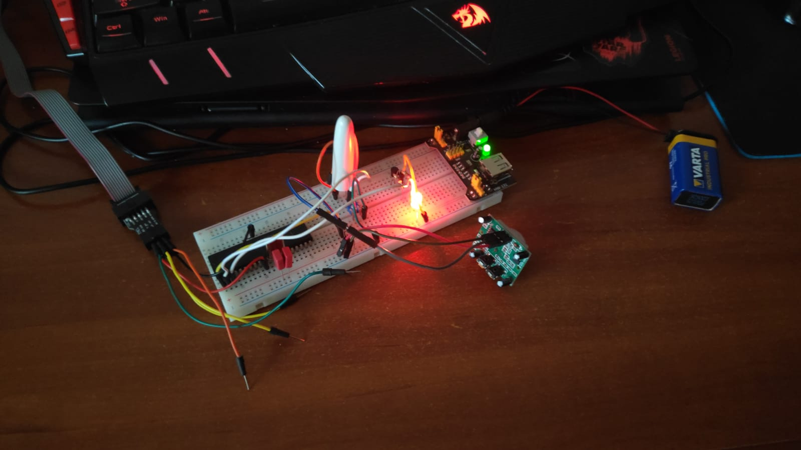
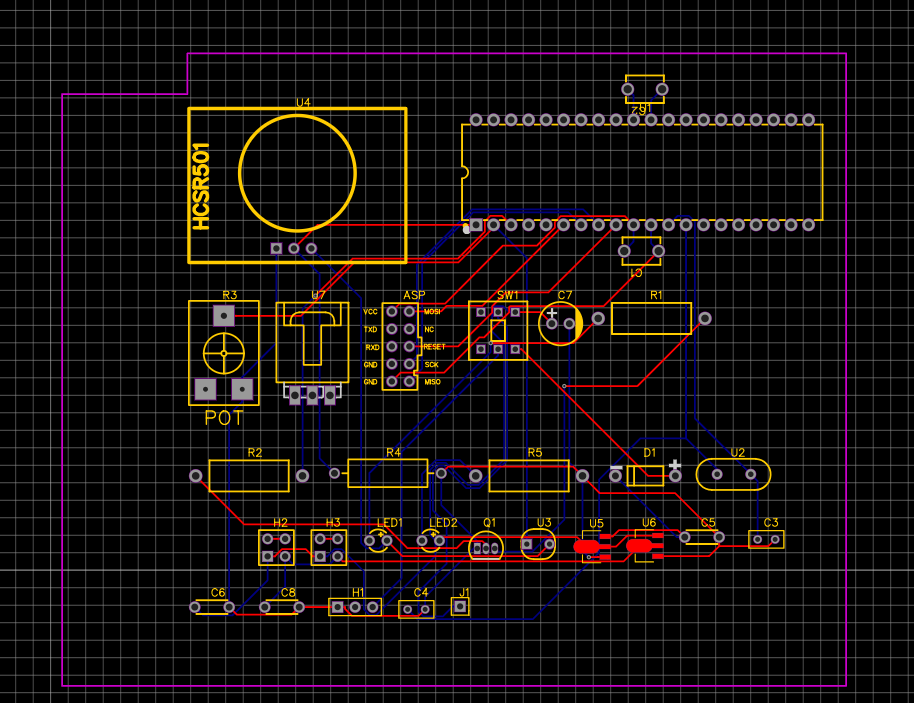
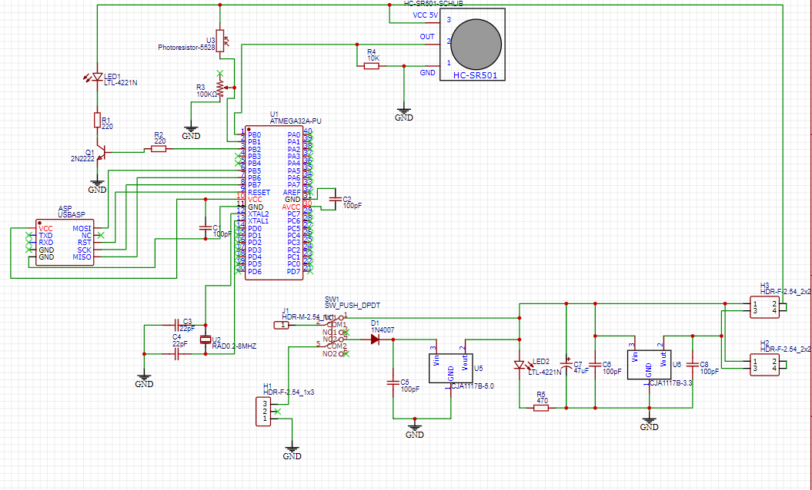

# Automatic Staircase Light with ATmega32

## Hardware:

- ATMEGA32A
- Power supply (5v),
- AVR-ISP PROGRAMMER
- 100uF capacitor
- LED
- 220Ω, 1KΩ resistors
- LDR(Light Dependent Resistor)
- 100KΩ pot or preset,
- Any motion sensor module (HC-SR501)
- 2WATT LED (optional)
- TIP122 transistor.

## Software:

- Microchip Studio for AVR® and SAM
- AVRDUDES - For Atmega32 programing

## Breadboard OFF:

## Breadboard ON:

## PCB Layout:

## Schema:

